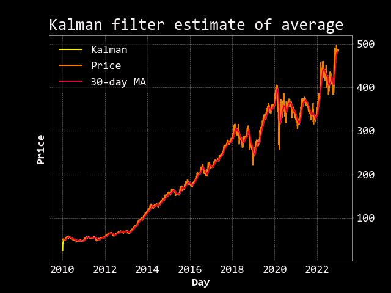
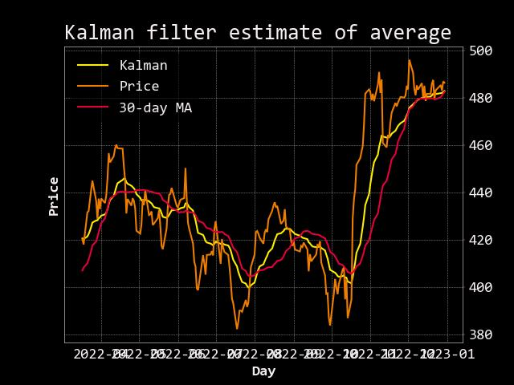

# Kalman filter
and OpenBB for parameterless indicators
https://www.bzarg.com/p/how-a-kalman-filter-works-in-pictures/

Use the Kalman filter to smooth stock prices.

The Kalman filter is an algorithm that tracks an object in state space. Given a sequence of noisy measurements, the Kalman Filter recovers the "true state" of the object. You will recover the "true average" of a series of stock prices.

The Kalman filter updates its estimates at every time step so it’s useful for estimating rolling parameters. Quants use it to smooth trading indicators on noisy price data to signal trading opportunities. The Kalman filter is an unsupervised learning algorithm so you don’t need to select a window length. This helps reduce the risk of overfitting-though does not remove it.

**Use the Kalman filter to smooth rolling indicators**

The Kalman filter is useful for computing the moving average or for smoothing out estimates of other quantities. For example, if you already computed the moving Sharpe ratio, you can smooth it using a Kalman filter. At each time step, the algorithm estimates the current state of the system using the transition matrix, takes in new measurements, then updates the estimated current state.

**OpenBB SDK**

OpenBB is a leading open source investment research software platform for accessing and analyzing financial market data. The SDK provides a convenient way to access raw financial data from multiple data providers using the same architecture as the OpenBB Terminal.

---

**Import required Libraries:**

- Pandas

- matplotlib

- pyKalman

- openbb

---

**Key Takeaways:**

- Get stock price data with the OpenBB SDK

- Build a moving average with the Kalman filter

---

## Step 1: Get stock price data with the OpenBB SDK

Start by importing the libraries you need. pykalman is the “dead-simple” Kalman filter library for Python.

---

## Step 2: Build a smoothed average with the Kalman filter
Start by setting the initial paramaters for the Kalman filter.

The transition matrix tells the algorithm how the system evolves from one state to another. The observation matrix tracks the next measurement given the predicted next state. The initial mean and covariance are the initial estimates of the state and error and the covariances measure the noise in the evolution of the algorithm. In more complex examples, you can calibrate these inputs to give a better first estimate.

After the inputs are defined for the Kalman filter algorithm, use it to filter the prices and find the "true" average.

**Kalman Filter Estimate of Average**

Notice the Kalman filter starts with an estimate that is far away from the prices. That’s because we seeded the algorithm with a matrix of 1s. Within only a few time steps it corrects and more accurately models the price series.

---

Zoom in on the last 200 days to get a closer look.

**Kalman Filter Estimate of Average Recent 200 Days**

The Kalman filter works well on noisy data and trains quickly without labeled data (it’s an unsupervised learning algorithm). Use it to smooth rolling metrics on noisy stock price data.